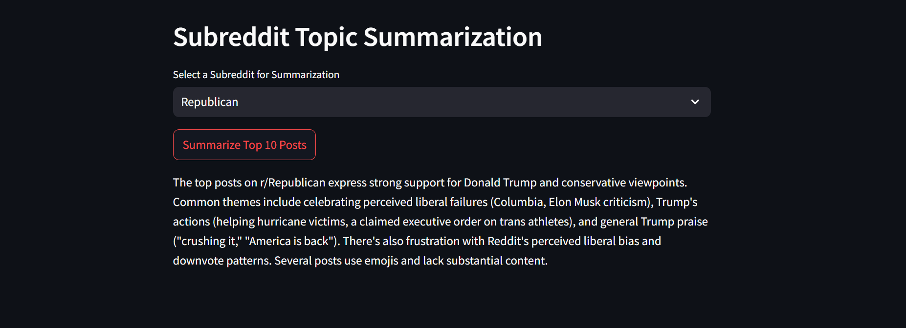
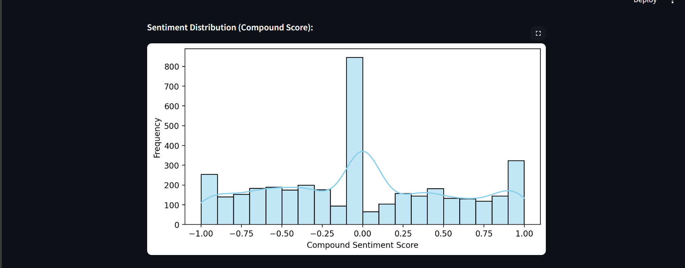
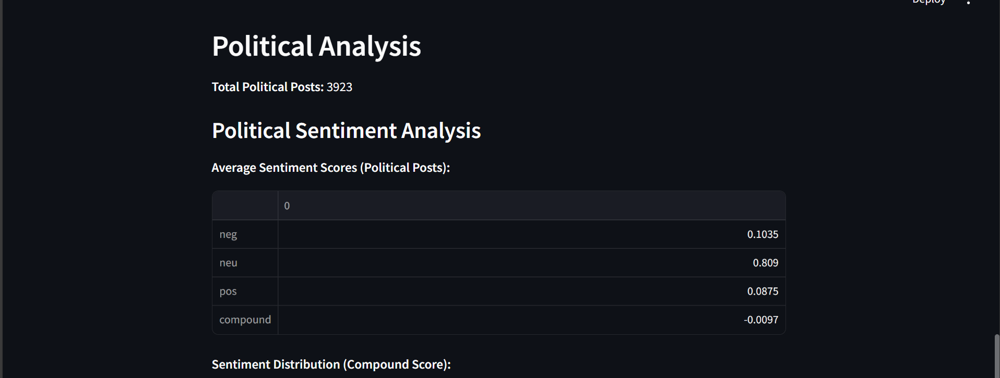
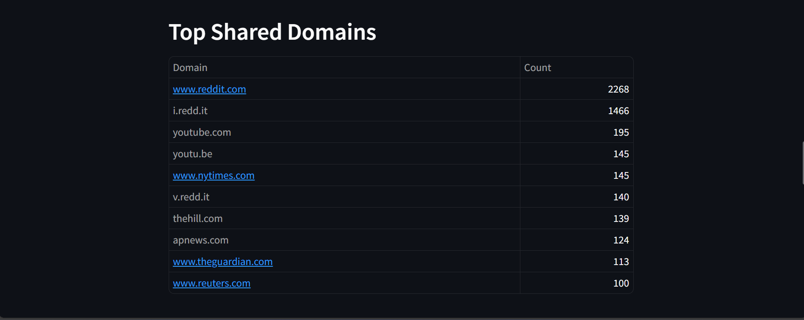
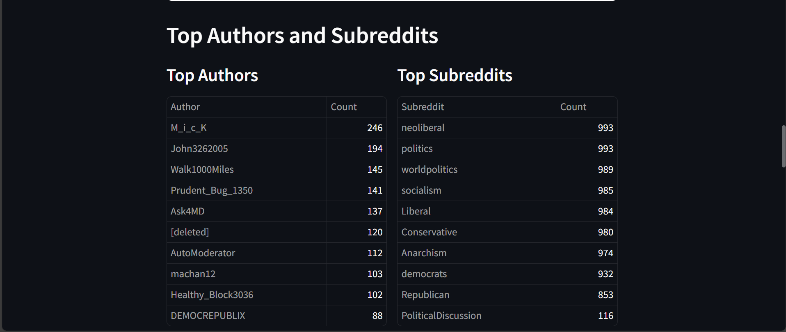
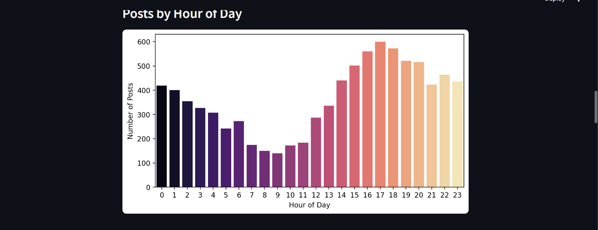
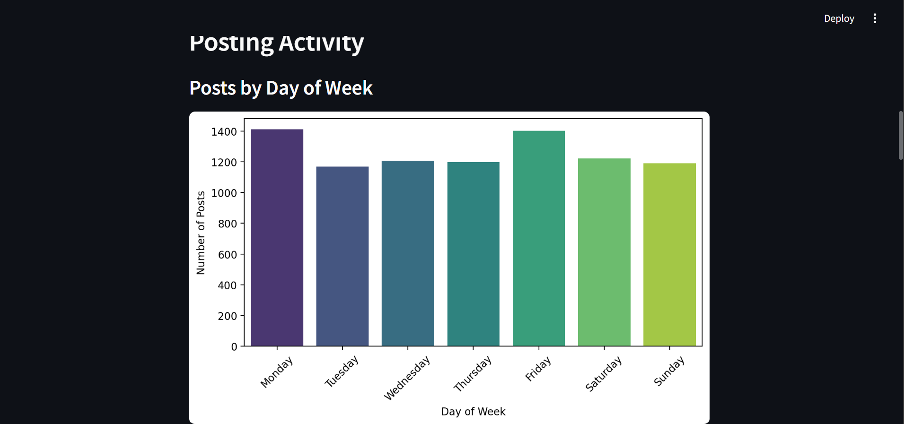
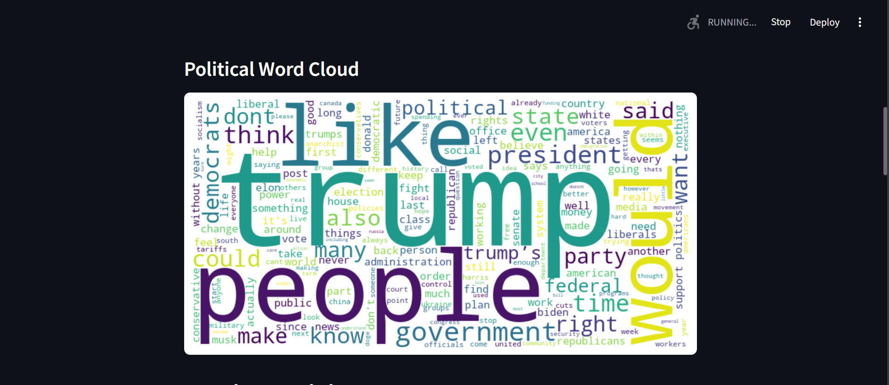
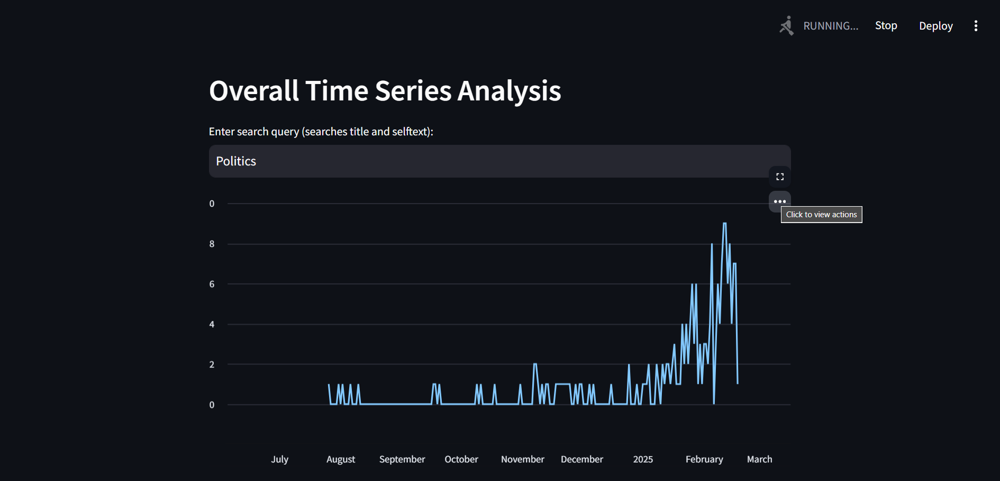
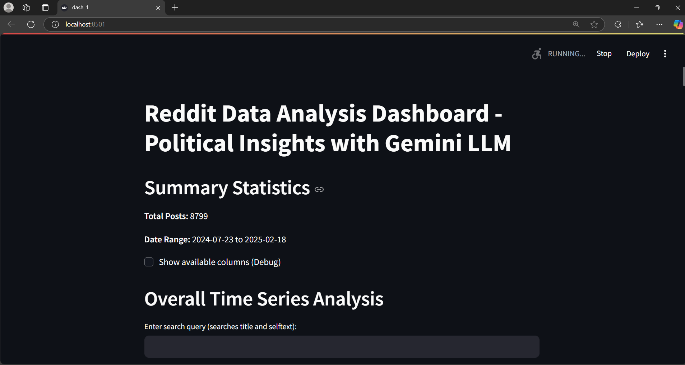

In today’s digital era, political discussions on online forums like Reddit reveal more than just opinions—they show community dynamics, posting behaviors, and sentiment trends. This dashboard uncovers that narrative through:

Time Series Analysis: Visualizing the evolution of posts over time to capture bursts of political activity.
Keyword Analysis & Word Clouds: Highlighting dominant themes and frequently used words, with “trump” often emerging as a key term.
Posting Activity Trends: Analyzing posts by day of the week and hour of the day to illustrate when users are most engaged.
Network Visualization: Mapping the relationships between authors and subreddits to reveal influential communities.
Sentiment Analysis: Evaluating the emotional tone of political posts to quantify public sentiment.
Narrative Summarization: Leveraging Gemini LLM to generate concise summaries that contextualize the quantitative insights.

         